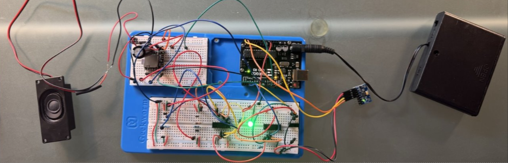
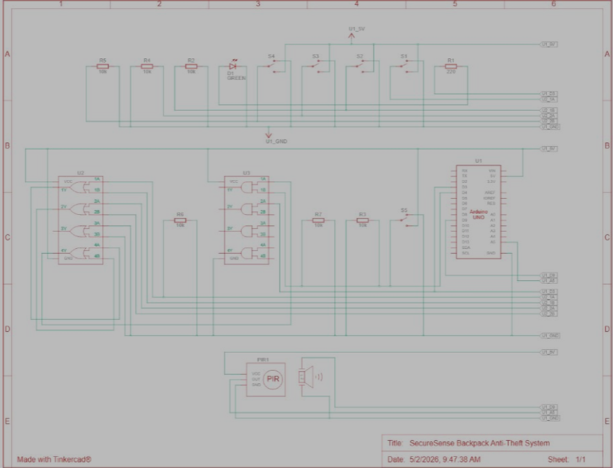

# Backpack Security Alarm System

A hybrid hardware/embedded system that protects backpacks from theft using magnetic zipper detection (Hall sensors), motion sensing (IMU), and audible alerts (DFPlayer + Speaker).

## System Flow
1. **Arm:** User turns the 3-pin slide switch to ON.
2. **Detect:** 
   - 4x Hall sensors watch the zipper magnets (Logic path via 74HC32 OR gate).
   - MPU6050 IMU detects movement/tilt (I2C path to Arduino).
3. **Process:** Logic gates (AND + OR) combine signals with the arming switch.
4. **Alert:** Arduino triggers a green LED and plays an audio warning through the DFPlayer Mini + 3W speaker.
## Prototype Photo

## Hardware Components
| Component | Quantity | Function |
|-----------|----------|----------|
| Arduino Uno | 1 | Main controller (reads IMU, controls audio) |
| MPU6050 IMU | 1 | Detects motion/tilt via I2C |
| 74HC32 (OR Gate) | 1 | Combines signals from 4 Hall sensors |
| 74HC08 (AND Gate) | 1 | Enables alarm based on arming switch |
| A3144 Hall Effect Sensors | 4 | Detect zipper magnets |
| Neodymium Magnets | 4 | Attached to zipper pulls |
| DFPlayer Mini | 1 | MicroSD MP3 player with built-in amplifier |
| 3W 4-Ohm Speaker | 1 | Audio output |
| 3300µF Capacitor | 1 | Smooths power spikes for DFPlayer |
| 10kΩ Resistors | 5 | Pull-down resistors for sensors/switch |
| 1kΩ Resistor | 1 | Series protection for DFPlayer TX→RX |
| Green LED | 1 | Visual trigger indicator |
| 3-pin Slide Switch | 1 | Master arm/disarm |

## Schematic & Simulation Notes

The circuit was first validated in **TinkerCAD** before physical assembly. Since TinkerCAD's library does not contain the exact components used in the physical prototype, the following functionally equivalent substitutes were used to model the logic and behavior:

| Physical Component (Actual Hardware) | Simulation Substitute (TinkerCAD) | Justification |
| :--- | :--- | :--- |
| A3144 Hall Effect Sensors + Magnets | Slide Switches | Both act as digital ON/OFF triggers. The slide switch simulates the magnet passing over the sensor (logic HIGH/LOW). |
| MPU6050 Accelerometer (I2C) | PIR Motion Sensor | Both provide a digital HIGH output when motion is detected. The simulation focuses on the trigger logic, not the I2C communication protocol. |
| DFPlayer Mini + 3W Speaker | Piezo Buzzer | Both produce an audible alert when driven by a digital output from the Arduino. The simulation verifies the timing and logic of the alert activation. |

✅ **Physical Validation:** The simulation confirmed the logic gate behavior. The physical prototype was then built using the exact BOM components, with the additional real-world challenges (power spikes, faulty breadboard rails) solved during hardware debugging.

## Testing & Validation
- **Simulated zipper opening:** Removed magnets from Hall sensors → LED turned on instantly, confirming logic gate detection.
- **Motion detection:** IMU successfully triggered alerts when the backpack was lifted or tilted.
- **Audio test:** DFPlayer played MP3 files clearly through the speaker.

## Challenges Faced & Solved
- **Problem:** Logic gates worked in TinkerCAD simulation but failed on the physical breadboard (intermittent signals).
- **Root Cause:** Faulty breadboard internal rails.
- **Fix:** Replaced the breadboard, rechecked all connections, and replaced long fragile wires with more durable connections. System worked immediately after the fix.

## Future Improvements
- Replace the breadboard prototype with a custom **2-layer PCB** (KiCad) to improve reliability and reduce size.
- Migrate from Arduino Uno to an **ATTiny85** for lower power consumption and portability.

## Status
**✅ Fully built and tested on breadboard.** PCB redesign in progress.
